---
### 👉作者QQ ：1556708905 微信：zheng0123Long (支持修改、部署调试、定制毕设)

### 👉接网站建设、小程序、H5、APP、各种系统等

### 👉选题+开题报告+任务书+程序定制+安装调试+ppt 都可以做
---

**毕业设计所有选题地址 [https://github.com/zhengjianzhong0107/allProject](https://github.com/zhengjianzhong0107/allProject)**

**博客：
[https://blog.csdn.net/2303_76227485/article/details/128640401](https://blog.csdn.net/2303_76227485/article/details/128640401)**

**视频演示：
[B站视频演示](https://www.bilibili.com/video/BV1jG411N7iw)**

## 基于springboot的酒店预订管理系统(源代码+数据库+10000字文档)

## 一、系统介绍

本项目分为管理员与普通用户两种角色

管理员角色包含以下功能：

- 超级管理员拥有所有权限  

- 后台功能：
  
  工作人员管理、角色管理、应用管理、
  
  日志管理、客户管理、留言管理、
  
  房型管理、房间管理、预约订单管理、
  
  入住管理、统计分析管理

用户角色包含以下功能：

- 客户登录、找回密码
- 留言板留言
- 浏览客房和预定客房

## 二、所用技术

- 前端技术栈

- jsp、layer、easyui

- 后端技术栈

- springboot，java，mysql，mybatis

## 三、环境介绍

基础环境 :IDEA/eclipse, JDK 1.8, Mysql5.7及以上,,Maven

所有项目以及源代码本人均调试运行无问题 可支持远程调试运行

## 四、项目截图

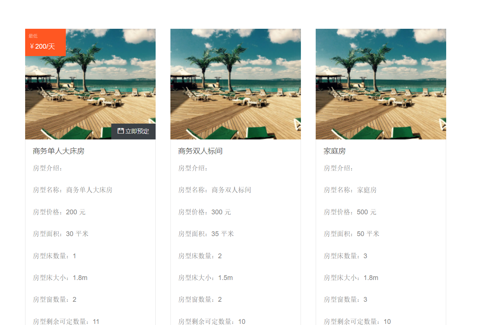

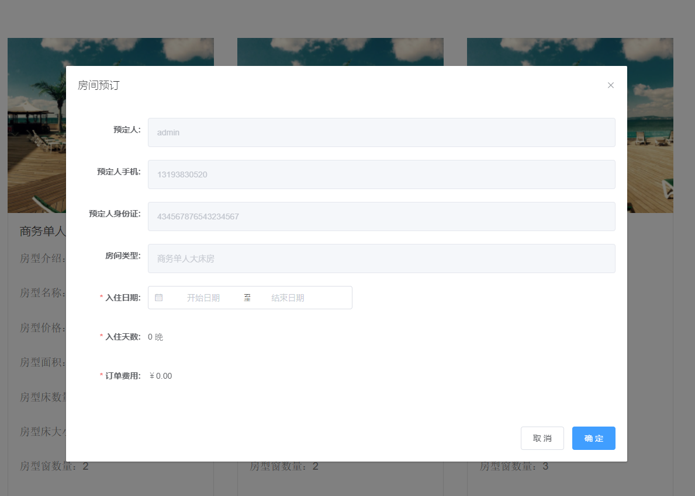

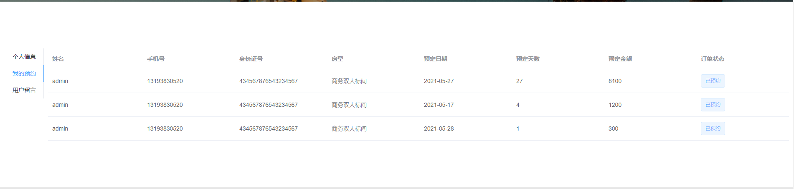

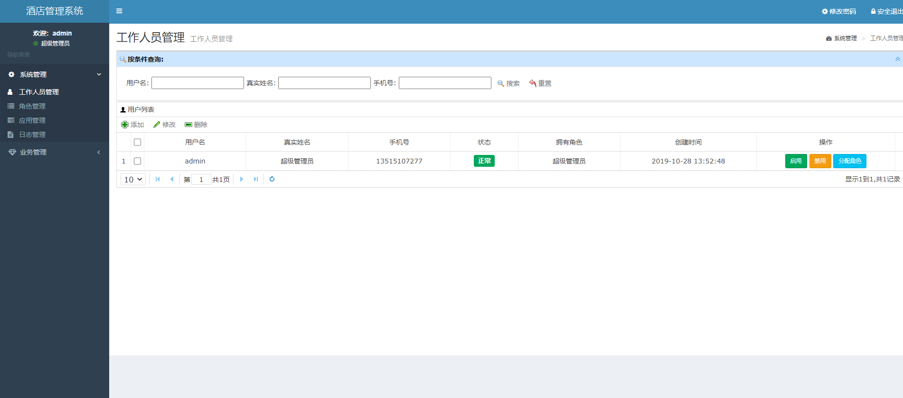

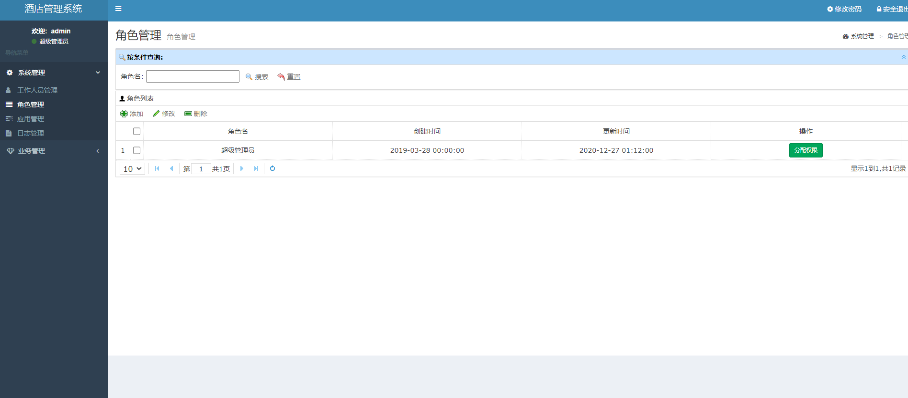

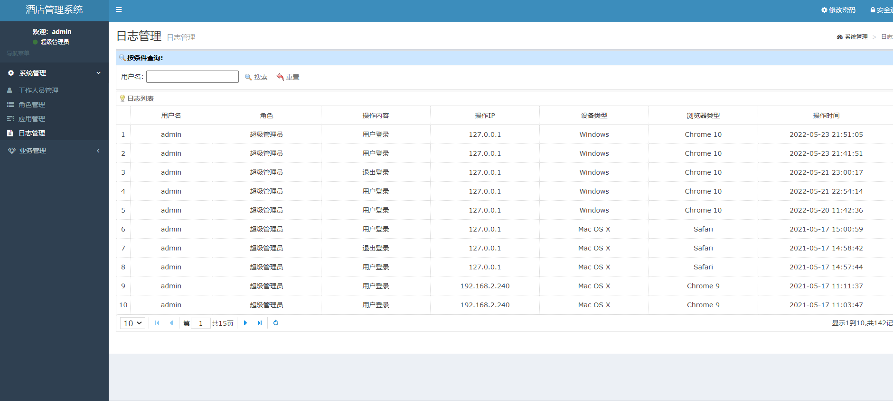

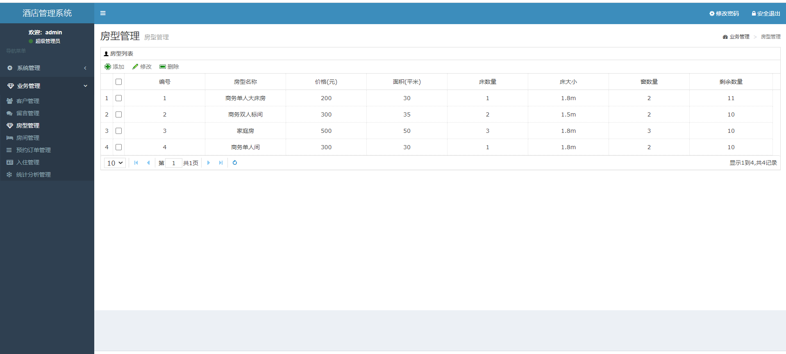

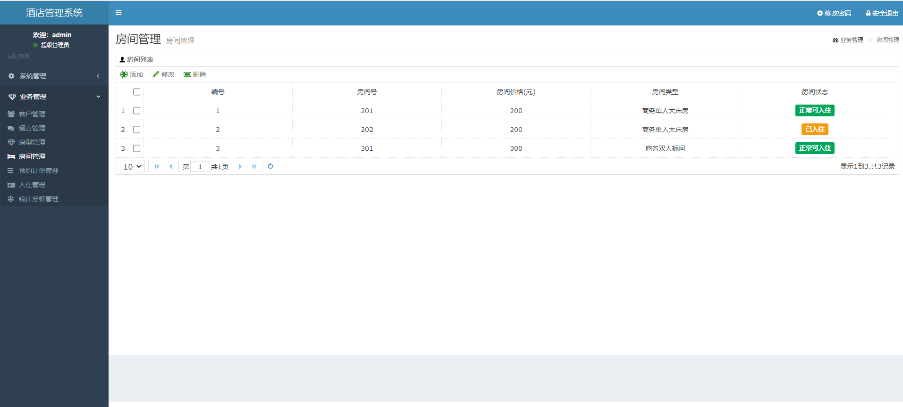

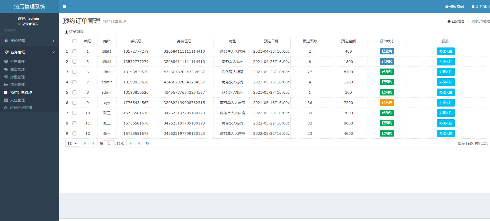

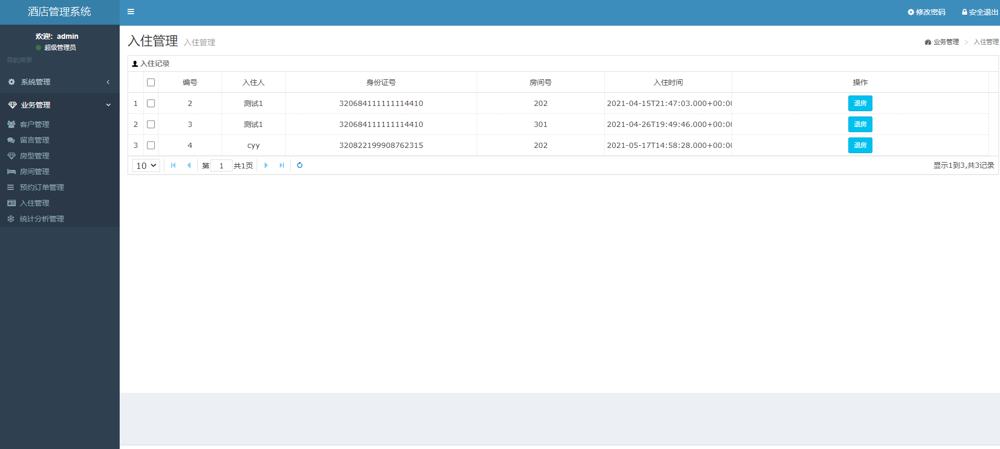

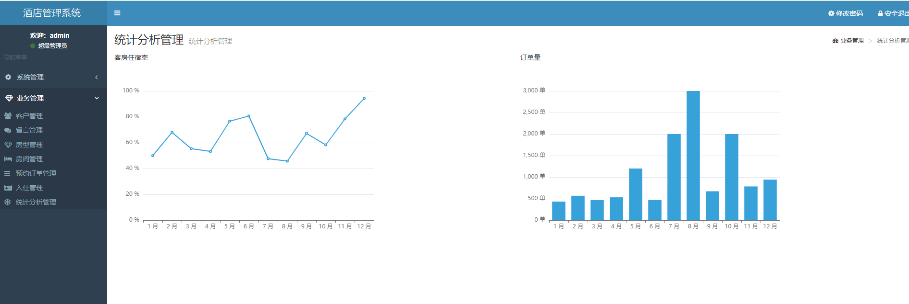

## 五、浏览地址

前台地址    http://localhost:8088/

用户名：zhangsan   密码：123456

后台登录地址  http://localhost:8088/admin/login

用户名：admin   密码：123456

## 六、安装教程

1. 使用Navicat或者其它工具，在mysql中创建对应名称的数据库，并导入项目的sql文件；

2. 使用IDEA/Eclipse导入项目，若为maven项目请选择maven;导入成功后请执行maven clean;maven install命令，然后运行；

3. 进入src/main/resources修改application.properties里面的数据库配置

4. 启动项目后端项目 
